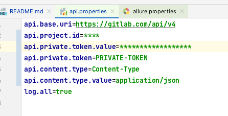
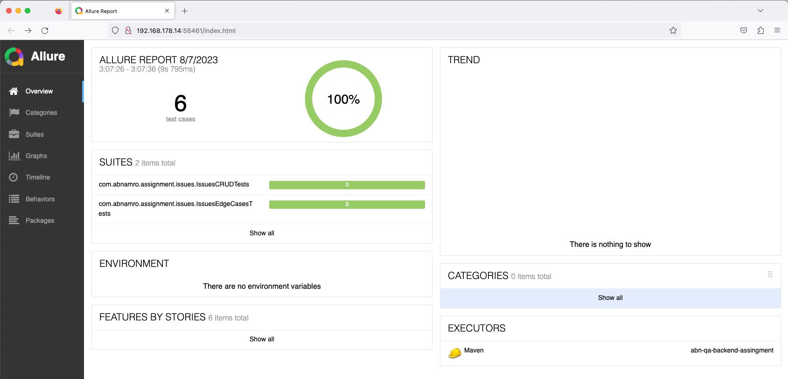
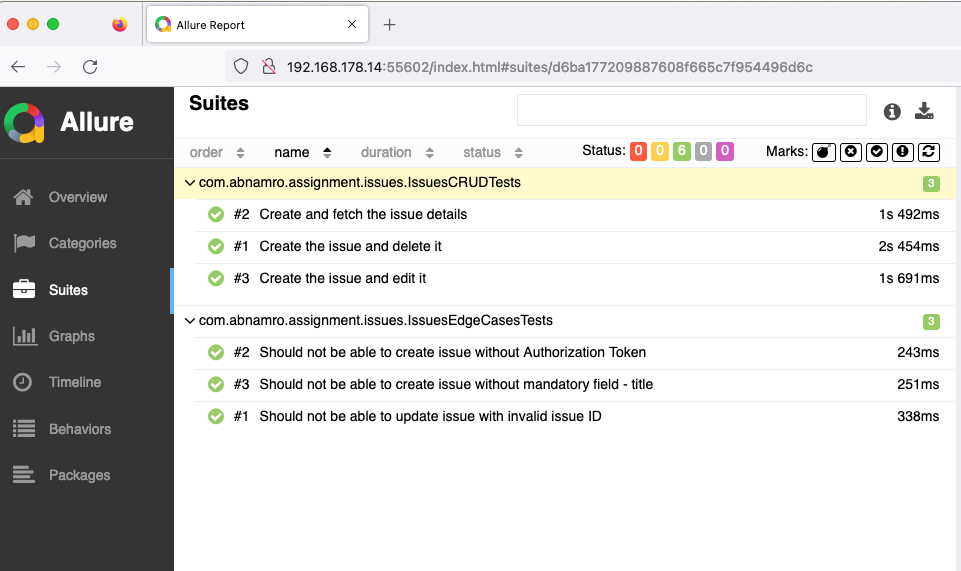
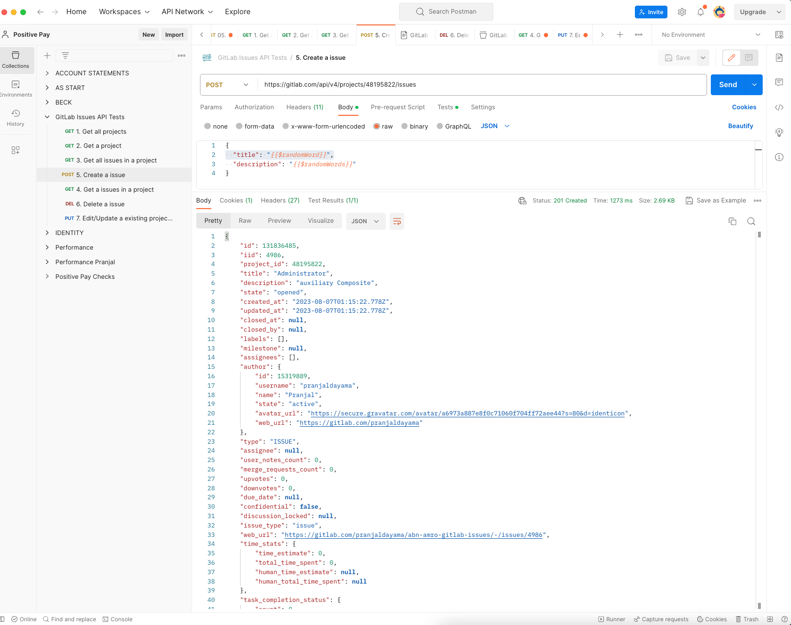
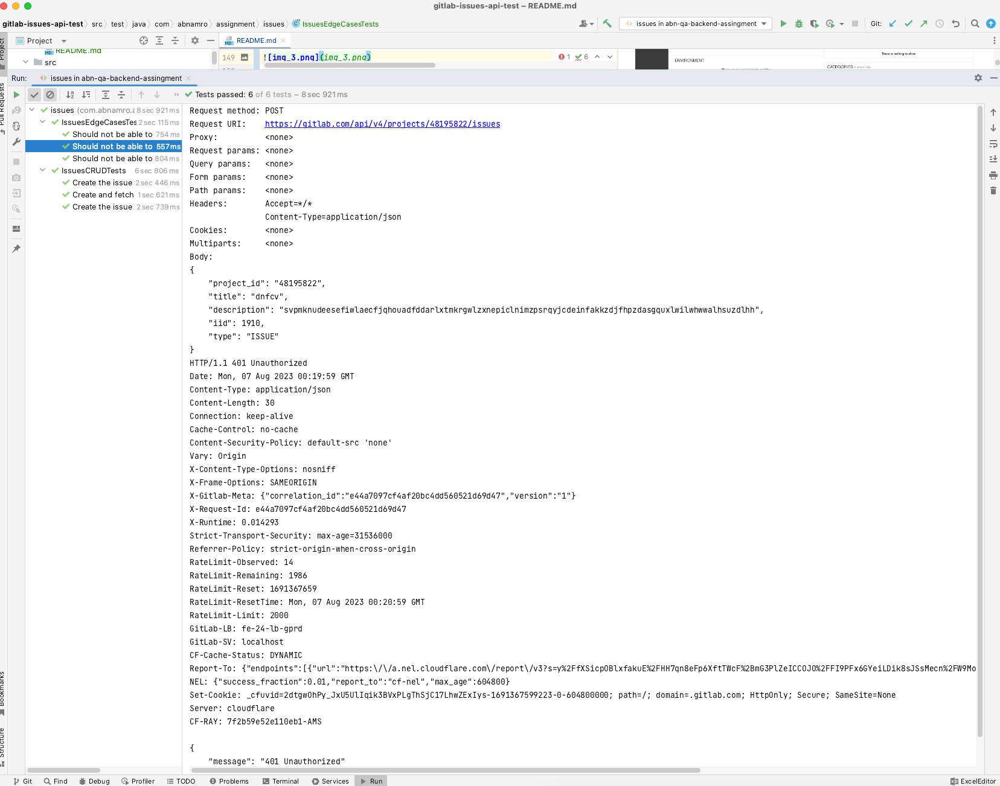

# Backend Test Automation Assignment [](https://gitpod.io/from-referrer/)

<a href="https://gitpod.io/from-referrer/" style="padding: 10px;">
    
</a>

## Requirements
### Environment
* GitHub account
* Java 11 (JDK) (optionally)
* Maven 3.6+ (optionally)
* Any IDE you comfortable with (eg. IntelliJ, VSCode)

### Skills
* Java 8+ (coding standards)
* Clean Code
* Maven
* Git, GitLab, GitHub

### Instructions
Fork this project
<details>
<summary>Example</summary>

   
</details>

#### Working in Web IDE (preferable)

1. Open Project in [GitPod](https://gitpod.io/from-referrer/):
2. Sing-in with GitHub account
3. Create and commit your solution into your forked repository
4. Create documentation in the README.md under the `Documentation` section
5. IMPORTANT: Enable Repository permissions (e.g. git push) for GitPod when coding from Web IDE here:
   https://gitpod.io/integrations
   <details>
   <summary>Details here</summary>

   Edit permission for GitHub:

   

   
   </details>

# Documentation

## Purpose of the project

This is a rest api test framework created to build the automated tests for Gitlab Issues API using Rest-Assured and Java.
Gitlab Issues API : https://docs.gitlab.com/ee/api/issues.html

## Required software

* Java JDK 17+
* Maven installed and in your classpath

## Project Structure 

### src/main/java

#### test

**BaseTest** class in which the initial steps to create the requests using RestAssured and to log all the details of requests and response.

#### client
IssueClient class which performs actions (GET - fetch, POST - create, PUT - edit) using the endpoints. This class is used by the IssueTests classes.

#### config

Library used to manage the properties file : 
https://matteobaccan.github.io/owner/

Class `Configuration` is the connection used to load the property file `api.properties` located in `src/test/resources`
 
`@Config.Sources` loads the properties file and match the attributes with the `@Key`, so that the value can be automatically fetched.

```java
@Config.Sources({
    "system:properties",
    "classpath:api.properties"})
```

`system:properties` will get the property values from the system (as environment variables or from the command line)
`api.properties` It will load file from the classpath.
The environment variables are read on the `ConfiguratorManager`

This class reduces the amount of code used to load, convert and manage the properties file. We can use the properties file in a simplest way possible.

#### data
`changeless` : IssueData : contains the test data which is fixed strings and final.
`factory` : IssueDataFactory : which uses [java-faker](https://github.com/DiUS/java-faker) to generate fake data.
Lombok is used to generate objects using the builder pattern.

#### model
Model are created to map the objects through serialization and deserialization

#### specs
Request and Response specifications used by the clients and e2e tests.
Class `InitialStepsSpec` sets the baseURI and the headers like content-type and private-token.
Class `IssueSpecs` contains the implementation of request and response specifications.

### src/test/java

#### issues
Contains the rest assured tests to test the CRUD operations and edge cases for Gitlab Issues api

### src/test/resources
It contains properties file and the allure properties file

#### postman
Contains the postman tests for investigation purpose.

## Libraries used in the project
* [RestAssured](http://rest-assured.io/) : Used to test the rest api
* [Owner](https://matteobaccan.github.io/owner/) : Used to access the properties from the property file
* [JUnit 5](https://junit.org/junit5/) : Used to support the tests creation
* [java-faker](https://github.com/DiUS/java-faker) : Used to generate the fake data
* [Log4J2](https://logging.apache.org/log4j/2.x/) : Used for generating test logs
* [Allure Report](https://docs.qameta.io/allure/) : Used to generate the test reports

## How to execute the tests

In the file `api.properties` the values for `api.project.id` and `api.private.token.value` needs to be provided. Due to security reasons token should not be stored in the public repositories.
Hence, the values for `api.project.id` and `api.private.token.value` needs to be provided in the `api.properties` file, for example : 




Test suites can be directly executed by IDE or by command-line. Using `mvn test` will execute all the tests, as it is the regular Maven Lifecycle.
Test classes from `src\test\java` can also be executed.

To execute tests based on the groups defined use the property `-Dgroups` and the group names.
For example to execute the test related to CRUD operations and the edge cases for Gitlab Issues API: 

| group           | command                    |
|-----------------|----------------------------|
| CRUD tests      | `mvn test -Dgroups="crud"` |
| edge case tests | `mvn test -Dgroups="edge"` |


### Generating the test report

This project uses Allure Reporting tool to generate the test reports.
* io.qameta.allure dependency used in  `pom.xml` file
* `allure.properties` file on `src/test/resources`

How to generate the test reports?
* `mvn allure:serve`: It will open the test report in the browser
* `mvn allure:report`: It will generate the reports at location `target/site/allure-maven-plugin`

### Test Results










